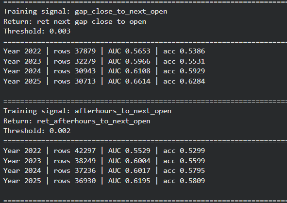
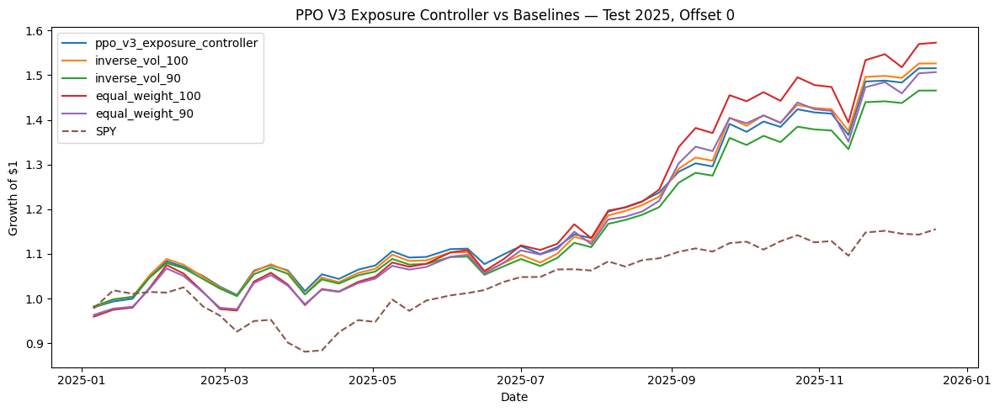

# Results

This document summarizes the main results from the **Machine Learning Portfolio Optimization Research** project.

The results should be read as research findings, not as proof of a production trading strategy. The project showed useful signal in some prediction windows and produced a working PPO exposure-control environment, but the final PPO strategy did not clearly outperform the strongest simple Top-10 baselines.

---

## 1. Results Overview

The project produced three main result categories:

1. **Prediction target comparison**  
   Different future-return windows were tested to see which movement targets were more predictable.

2. **Walk-forward signal testing**  
   Signal models were trained on earlier years and evaluated on later years to reduce lookahead bias.

3. **PPO portfolio comparison**  
   A PPO exposure controller was tested against SPY, equal-weight Top-10, and inverse-volatility Top-10 baselines.

The most important finding was that the engineered features contained some useful signal, especially for certain gap and extended-hours movement windows. However, the reinforcement learning policy still needs more work before it can be considered stronger than simple portfolio rules.

---

## 2. Dataset and Evaluation Context

The project used approximately five years of historical market data with daily and extended-hours features.

The cleaned modeling dataset included:

| Item | Value |
|---|---:|
| Rows used in feature dataset | ~239,000 |
| Tickers | 206 |
| Date range | 2021-05-10 to 2025-12-30 |
| Feature count in one target-comparison run | 94 |
| Final PPO test period | 2025 unseen test period |
| PPO basket size | Top-10 stocks |
| PPO action type | Exposure level |
| PPO exposure choices | 60%, 75%, 90%, 100% |
| Transaction cost assumption | 5 bps per side |

The key evaluation choice was to use time-aware testing instead of random splitting. This mattered because stock-market data is chronological, and random splitting can accidentally mix future information into training.

---

## 3. Prediction Target Comparison

The first major result came from comparing several future-return targets.

The goal was to avoid building the entire project around one noisy up/down target. Each movement window was treated as a different prediction problem.

The main targets included:

- Next gap: close-to-next-open
- Next close-to-close
- Next open-to-close
- Future two-day close-to-close
- Future five-day close-to-close

The table below summarizes the strongest test result for each target from the target-comparison experiment.

| Target | Best model shown | Test rows | Test accuracy | Test AUC | Test log loss | Actual up rate |
|---|---|---:|---:|---:|---:|---:|
| Next gap close-to-open | XGBoost | 51,049 | 0.5776 | 0.6107 | 0.6713 | 0.5213 |
| Next close-to-close | XGBoost | 51,047 | 0.5272 | 0.5359 | 0.6910 | 0.5244 |
| Next open-to-close | XGBoost | 51,055 | 0.5048 | 0.5150 | 0.6955 | 0.5190 |
| Future 2-day close-to-close | XGBoost | 50,627 | 0.5536 | 0.5600 | 0.6869 | 0.5360 |
| Future 5-day close-to-close | Logistic Regression | 49,986 | 0.5413 | 0.5462 | 0.6837 | 0.5498 |

---

## 4. Prediction Target Interpretation

The target-comparison results showed that not all stock-movement targets behaved the same way.

The **next gap close-to-open** target performed the best in this comparison, with test accuracy around **57.8%** and test AUC around **0.611**.

This suggested that overnight or gap-style movement had more learnable structure than some regular-session targets.

The **next open-to-close** target was much weaker, with accuracy close to the base rate. This showed that intraday direction was harder to predict with the available features.

The main lesson was:

**Stock prediction is not one single problem. The prediction window matters a lot.**

A feature set can look useful for one target and weak for another. Because of this, the project moved toward a multi-signal approach instead of depending on only one future-return definition.

---

## 5. Walk-Forward Signal Results

A stronger walk-forward signal test was used after the initial target comparison.

In this setup, each score year was evaluated using only earlier years for training. This made the test more realistic because the model could not train on future data.

Two important walk-forward signals were:

1. `gap_close_to_next_open`
2. `afterhours_to_next_open`

The strongest signal result came from the `gap_close_to_next_open` signal.

| Signal | Year | Rows | AUC | Accuracy |
|---|---:|---:|---:|---:|
| gap_close_to_next_open | 2022 | 37,879 | 0.5653 | 0.5386 |
| gap_close_to_next_open | 2023 | 32,279 | 0.5906 | 0.5531 |
| gap_close_to_next_open | 2024 | 38,943 | 0.6168 | 0.5929 |
| gap_close_to_next_open | 2025 | 36,713 | 0.6614 | 0.6284 |

The `afterhours_to_next_open` signal also showed useful results.

| Signal | Year | Rows | AUC | Accuracy |
|---|---:|---:|---:|---:|
| afterhours_to_next_open | 2022 | 42,297 | 0.5529 | 0.5299 |
| afterhours_to_next_open | 2023 | 38,249 | 0.6084 | 0.5795 |
| afterhours_to_next_open | 2024 | 37,236 | 0.6017 | 0.5795 |
| afterhours_to_next_open | 2025 | 36,398 | 0.6195 | 0.5890 |

---

## 6. Walk-Forward Signal Interpretation

The walk-forward signal results were one of the most important parts of the project.

The `gap_close_to_next_open` signal improved across the later test years and reached about **62.8% accuracy** in 2025. This was meaningful because short-term stock direction prediction is noisy and difficult.

However, the result still needs to be interpreted carefully.

Accuracy above 59% or even above 60% does not automatically mean the strategy is profitable. A model can be directionally correct more often than not and still lose money if:

- Wrong trades lose more than right trades gain
- Transaction costs are too high
- Slippage removes the edge
- The signal only works during one market regime
- The portfolio takes too much risk
- The test period is too short

Because of that, the project did not stop at accuracy. The signal was also tested through portfolio baskets and PPO baseline comparisons.

---

## 7. Visual: Walk-Forward Signal Results

The screenshot below shows part of the walk-forward signal output.

It includes the `gap_close_to_next_open` and `afterhours_to_next_open` signal results across multiple years.



---

## 8. PPO Exposure Controller Result

The PPO model was tested as an exposure controller.

The model did **not** directly select every stock weight. Instead:

1. The supervised signal model ranked stocks.
2. The Top-10 stocks were selected each period.
3. A base Top-10 portfolio was created.
4. PPO selected how much exposure to take in that basket.

This made the reinforcement learning problem smaller and more stable.

The PPO strategy was compared against:

- SPY benchmark
- Equal-weight Top-10, 100% exposure
- Equal-weight Top-10, 90% exposure
- Inverse-volatility Top-10, 100% exposure
- Inverse-volatility Top-10, 90% exposure

The table below summarizes the 2025 test comparison.

| Strategy | Mean avg net return 5d | Mean total return net | Median total return net | Sharpe-like score | Max drawdown | Mean exposure | Win rate vs SPY |
|---|---:|---:|---:|---:|---:|---:|---:|
| Equal-weight Top-10, 100% exposure | 0.0108 | 0.6613 | 0.7975 | 2.2356 | -0.1380 | 1.0000 | 0.6068 |
| Equal-weight Top-10, 90% exposure | 0.0098 | 0.5821 | 0.7009 | 2.2355 | -0.1248 | 0.9000 | 0.6111 |
| PPO V3 exposure controller | 0.0089 | 0.5193 | 0.5779 | 2.2580 | -0.1051 | 0.9402 | 0.5699 |
| Inverse-volatility Top-10, 100% exposure | 0.0089 | 0.5141 | 0.5698 | 2.1362 | -0.1215 | 1.0000 | 0.5821 |
| Inverse-volatility Top-10, 90% exposure | 0.0080 | 0.4550 | 0.5030 | 2.1361 | -0.1098 | 0.9000 | 0.5698 |
| SPY benchmark | N/A | 0.1673 | N/A | N/A | N/A | 1.0000 | N/A |

---

## 9. PPO Result Interpretation

The PPO result was useful, but it should not be overclaimed.

The PPO exposure controller performed much better than SPY during the 2025 test period. This suggested that the signal-based Top-10 basket contained useful information.

However, PPO did **not** clearly outperform the strongest simple Top-10 baselines.

The equal-weight Top-10 strategy had the highest mean total return net in the 2025 test comparison. PPO was competitive with the inverse-volatility baselines and had a smaller drawdown than several static strategies, but it was not the top-performing method overall.

The best interpretation is:

- The signal basket was useful.
- PPO learned reasonable exposure behavior.
- PPO beat SPY during the test year.
- PPO did not clearly beat the best simple Top-10 rules.
- The PPO environment worked as a first version.
- More tuning is needed before claiming PPO adds value beyond simple baselines.

This is actually a strong and honest result for a GitHub case study because it shows that the project evaluated the model against real baselines instead of only showing the best-looking result.

---

## 10. Visual: PPO vs Baselines

The plot below compares the PPO V3 exposure controller against the main baselines during the 2025 test period.

The PPO line stayed above SPY for most of the test period, but the equal-weight Top-10 baseline finished slightly higher.



---

## 11. Main Result Takeaways

The main takeaways from the results were:

### 1. Some prediction windows were more learnable than others

The close-to-next-open and afterhours-to-next-open signals were stronger than regular-session open-to-close movement.

This means the target definition mattered a lot.

### 2. Accuracy alone was not enough

The project found prediction accuracy above 59% in some tests and about 62.8% in the strongest 2025 walk-forward signal.

However, the project did not claim that accuracy alone proves profitability.

### 3. The Top-10 signal basket was useful

The Top-10 signal basket performed much better than SPY during the 2025 test period.

This suggested that the ranking model had some useful signal.

### 4. PPO was functional but not clearly superior

The PPO exposure controller beat SPY and produced reasonable behavior, but it did not clearly outperform the strongest Top-10 static baselines.

### 5. Simple baselines are hard to beat

The equal-weight Top-10 and inverse-volatility Top-10 strategies were very competitive.

This showed why baseline comparison is important in financial machine learning.

---

## 12. Why the Results Are Still Valuable

Even though PPO did not clearly beat the strongest baselines, the project was still valuable.

The project demonstrated a full research pipeline:

```text
historical market data
→ data cleaning
→ feature engineering
→ target comparison
→ multi-signal modeling
→ basket ranking
→ PPO exposure control
→ baseline comparison
→ results interpretation
```

This is stronger than simply showing a model accuracy number.

The project also showed practical understanding of financial ML issues such as:

- Data leakage
- Noisy targets
- Time-aware validation
- Market regime changes
- Transaction costs
- Baseline comparison
- PPO instability
- Reward design
- Portfolio constraints

These are important lessons for machine learning, data science, and reinforcement learning projects.

---

## 13. What Should Not Be Claimed

These results should **not** be described as a finished trading system.

The project should not claim:

- Guaranteed profitability
- A production-ready trading bot
- A market-beating strategy
- A fully validated reinforcement learning trading system
- A risk-free investment method

The correct way to describe the result is:

**The project found useful ranking signal in some target windows and built a working PPO exposure-control prototype, but the PPO strategy needs more tuning and longer out-of-sample testing before it could be considered reliable.**

---

## 14. Limitations Affecting the Results

Several limitations affected the results.

### Limited historical period

The dataset covered about five years. That was enough for a project, but financial models need longer testing across different market regimes.

### One-year PPO test period

The final PPO test focused on 2025. One year is useful, but not enough to make a strong claim about long-term strategy performance.

### Simplified transaction costs

The model included transaction costs, but a production system would need more realistic assumptions for:

- Bid-ask spread
- Slippage
- Market impact
- Liquidity constraints
- Execution timing

### PPO sensitivity

PPO was sensitive to:

- Reward function design
- Action space design
- Hyperparameters
- State features
- Market conditions

This made PPO harder to stabilize than the supervised ranking model.

### Missing news and event data

The current version did not fully include daily news sentiment, earnings events, analyst updates, or macroeconomic event features.

Those may be important for explaining large stock movements.

---

## 15. Final Results Summary

The strongest overall conclusion is:

**The supervised signal and ranking pipeline was more stable than the PPO agent, but PPO was successfully connected to a real financial portfolio environment.**

The signal models showed useful predictive behavior in some movement windows. The Top-10 basket performed well compared with SPY. PPO produced a reasonable exposure strategy, but the simple static Top-10 baselines remained difficult to beat.

This makes the project a strong first version and a good foundation for future work, especially with:

- Better reward design
- More out-of-sample testing
- More realistic trading assumptions
- News sentiment features
- Expanded PPO strategy comparisons
- Stronger statistical validation

The result is best described as a **working financial machine learning research prototype**, not a finished trading product.
